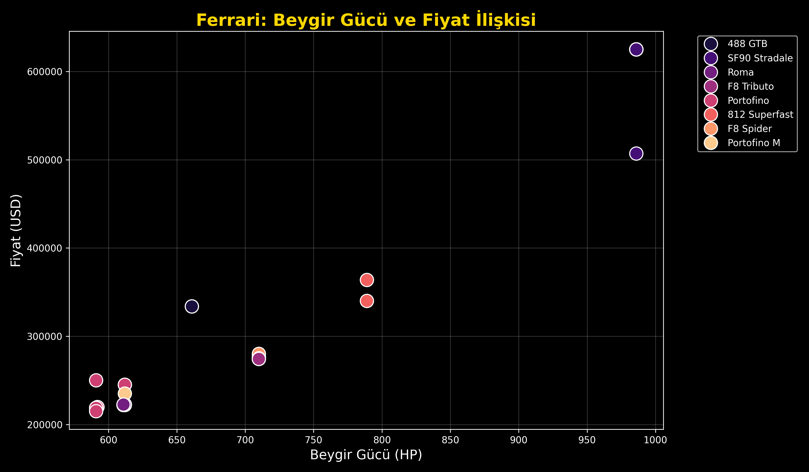

# 🏎️ Ferrari: Fiyat ve Performans Analizi (EDA)

Selamlar! Ben Yıldız Teknik Üniversitesi'nde İstatistik öğrencisiyim. Veri bilimi serüvenimde genelde hep hazır eğitim setleriyle pratik yapıyordum. Daha karmaşık verilere geçmeden önce, sevdiğim bir alandan başlayıp kendi verimi kendim analiz etmek istedim.

Bu repo, güncel spor araba satış verilerini kullanarak **Ferrari** modellerinin kaputunun altındaki beygir gücü (HP) ile fiyatları (USD) arasındaki ilişkiyi incelediğim bir Keşifçi Veri Analizi (EDA) adımıdır.

## 🛠️ Kullanılan Teknolojiler
* **Dil:** Python 3
* **Kütüphaneler:** Pandas, Matplotlib, Seaborn

## 📊 Çıktı: Pozitif Korelasyon ve SF90 Stradale
Yazdığım Python betiği (`araba_analiz.py`) ile veriyi temizleyip görselleştirdim. Ortaya çıkan grafik aşağıdadır:

Grafikte istatistikteki o meşhur "pozitif korelasyon" çok net görülüyor: Kaputun altındaki güç arttıkça fiyat da yukarı fırlıyor. Tabii sağ üst köşedeki **SF90 Stradale** hem fiyatı hem de gücüyle grafiğin geri kalanını pek takmamış, kendi liginde takılıyor. :)

## 🚀 Projeyi Kendi Bilgisayarında Çalıştırmak İçin
1. Bu repoyu bilgisayarına indir.
2. Gerekli kütüphaneleri kur: `pip install pandas matplotlib seaborn`
3. Terminal üzerinden kodu çalıştır: `python araba_analiz.py`

## 🔮 Gelecek Planları
Şimdilik ortada devasa bir makine öğrenmesi modeli yok, sadece işin temelindeki veri görselleştirme adımıyla ilgilendim. Ancak ileride kendimi geliştirdikçe bu veri seti üzerinde bir **Fiyat Tahmin Modeli** kurmayı da deneyeceğim.
